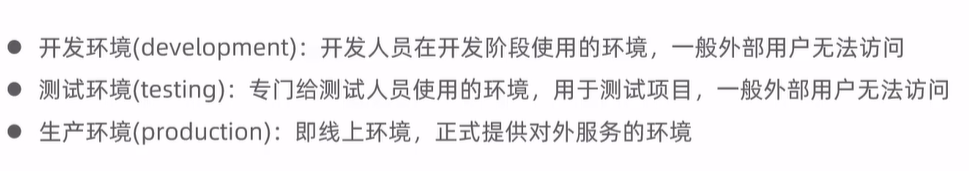

# 瑞吉外卖 笔记一

## 1.软件开发整体介绍

软件开发流程

角色分工

软件环境

## 2.外卖项目介绍

项目介绍

产品原型展示

技术选型

功能架构

角色

## 3.环境搭建

- 数据库搭建

- maven项目搭建

    1. .xml
    > 项目会用到很多框架,很多依赖.所以.XML不用自己去编写,直接导入
    
    .XML中的依赖分析:
        依赖是帮助更好的开发应用程序的.
        比如是spring boot项目,所以要去继承一个父工程
        <parent>表示继承; <artifactID>是继承的哪个; 还有版本记录

    2. .yml
    > spring boot的配置文件
    

    3. 配置文件OK-> 编写一个启动类

    Day1 配置文件就半天,注解问题困扰,进度好慢...
    启动类出现问题一连串~~~

- 导入前端

设置静态资源映射

启动项目，访问http://localhost:8080/backend/index.html~~至今无法启动

## 4.后台登录功能开发

- 需求分析

    - 登录页面展示~~

    - 查看登录请求信息 (浏览器F12)
    点击登录按钮-页面会发送请求 并提交参数
    

    - 数据模型
    

- 代码开发
    
    - 创建实体类Employee,和employee表进行映射

    Day2 进展缓慢

    - 创建Controller,Service,Mapper
    (把需要的类和接口都 创建 好;按照MybatisPlus的规范 继承)

    >  (补充知识)
    1. SSM框架使用
    

    2. MSCM是什么及其作用
        1. controller
        控制层.
        相当于MVC的C层,controller通过 service的接口 来控制业务流程;也可通过接收 前端传过来的参数 进行业务操作

        2. model
        数据模型层.
        相当于MVC的M层，存放实体类，与数据库中的 属性值 基本一致

        3. service
        业务逻辑层.
        主要是针对 具体的问题 的操作,把一些数据层的操作进行组合,间接和数据库打交道(提供 操作数据库 方法)

        4. mapper
        数据存储对象
        相当于DAO层,mapper层直接和 数据库 打交道(执行SQL语句),接口提供给service层
        

    EmployeeMapepr

    EmployeeService

    EmployeeServiceImpl

    EmployeeController

    - 导入返回结果类R
        - 一个通用结果类,后面编写很多Controller 方法很多,基本都是响应客户端页面发出的请求-controller处理-给页面结果;
        返回结果都统一封装成一个对象(通过R类)

    - 在Controller中创建登录方法

    
    

- 功能测试  
    ~~Debug调试 对功能全方位调试

## 5.后台退出功能开发

- 需求分析
 

- 代码开发
    

- 功能测试

