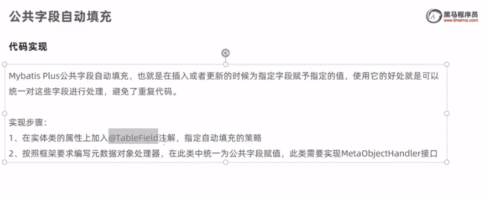

# 瑞吉外卖 笔记三


## 公共字段自动填充

- 问题分析
前面实现的后台系统中员工管理功能开发,新增员工时,需要设置创建事件/创建人/修改事件/修改人等字段,在编辑员工时需要设置修改时间和修改人等字段。这些字段属于公共字段，也就是很多表中都有这些字段，如下:


能不能对于这些公共字段在某个地方统一处理，来简化开发呢?  
答案就是使用Mybatis Plus提供的**公共字段自动填充**

- 代码实现


- 功能测试
通过设置断点,追踪employee对象的属性值,来确定公共字段是否赋上了

- 功能完善
前面我们已经完成了公共字段自动填充功能的代码开发，但是还有一个问题没有解决，就是我们在自动填充createUser和updateUser时设置的用户id是固定值，现在我们需要改造成动态获取当前登录用户的id。

有的同学可能想到，用户登录成功后我们将用户id存入了HttpSession中，现在我从HttpSession中获取不就行了?

**注意,**我们在MyMetaObjectHandler类中是不能获得HttpSession对象的，所以我们需要通过其他方式来获取登录用户id。

可以使用**ThreadLocal**来解决此问题,它是JDK中提供的一个类。

在学习ThreadLocal之前，我们需要先确认一个事情，就是**客户端发送的每次http请求，对应的在服务端都会分配一个新的线程来处理**，在处理过程中涉及到下面类中的方法都**属于相同的一个线程**:

1、LoginCheckFilter的`doFilter`方法

2、EmployeeContraller的`update`方法

3、MyMetaObjectHandler的`updateFill`方法

可以在上面的三个方法中分别加入下面代码(获取当前线程id):
```java
long id = Thread.currentThread().getId() ;
log.info("线程id:{}" ,id);
```
执行编辑员工功能进行验证，通过观察控制台输出可以发现，一次请求对应的线程id是相同的:


**什么是ThreadLocal?**  
ThreadLocal并不是一个Thread，而是Thread的局部变量。当使用ThreadLocal维护变量时，ThreadLocal为每个使用该变量的线程提供独立的变量副本，所以每一个线程都可以独立地改变自己的副本，而不会影响其它线程所对应的副本。
ThreadLocal为每个线程提供单独一份存储空间，具有线程隔离的效果，只有在线程内才能获取到对应的值，线程外则不能访问。

ThreadLocal常用方法：

 - public void set(T value) 设置当前线程局部变量的值
 - public T get() 返回当前线程所对应的线程局部变量的值

所以,  
我们可以在LoginCheckFilter的`doFilter`方法中获取当前登录用户id，并调用ThreadLocal的`set`方法来设置当前线程的线程局部变量的值(用户id)，然后在MyMetaObjectHandler的`updateFill`方法中调用ThreadLocal的`get`方法来获得当前线程所对应的线程局部变量的值(用户id)。

**实现步骤:**


代码测试~~


## 新增分类

- 需求分析
后台系统中可以管理分类信息，分类包括两种类型，分别是菜品分类和套餐分类。当我们在后台系统中添加菜品时需要选择一个菜品分类，当我们在后台系统中添加一个套餐时需要选择一个套餐分类.  
在移动端也会按照菜品分类和套餐分类来展示对应的菜品和套餐。


- 数据模型
新增分类,本质就是把我们 新增窗口录入的 新增数据 插入到category表，表结构如下:


- 代码开发
0. 在开发业务功能前,先将需要用到的类和接口 基本结构创建好:
    

1. 在开发外卖之前,需要梳理一下整个程序的执行过程:


## 分类信息分页查询

- 需求分析
一个页面中全部展示出来会显得比较乱，不便于查看，所以一般的系统中都会以分页的方式来展示列表数据。

- 代码开发


- 功能测试


## 删除分类

- 需求分析
在分类管理列表页面，可以对某个分类进行删除操作。  
需要注意的是当分类关联了菜品或者套餐时，此分类不允许删除。

- 代码开发
0. 在开发代码之前，需要梳理一下整个程序的执行过程:

1. 

- 功能测试
 ~~

- 功能完善
前面我们已经实现了根据id删除分类的功能，但是并没有检查删除的分类是否关联了菜品或者套餐，所以我们需要进行功能完善。


关键代码
- 在CategoryService添加remove方法
- 在CategoryServicelmpl实现remove方法
- 定义异常类CustomException
- 在全局异常处理器GlobalExceptionHandler添加

功能测试~~

## 修改分类

- 需求分析
在分类管理列表页面 点击修改按钮， 弹出修改窗口，在修改窗口 回显分类信息(VUE实现了,修改就是赋值的过程)并进行修改，最后点击确定按钮 完成修改操作


- 代码开发


- 功能测试~~

