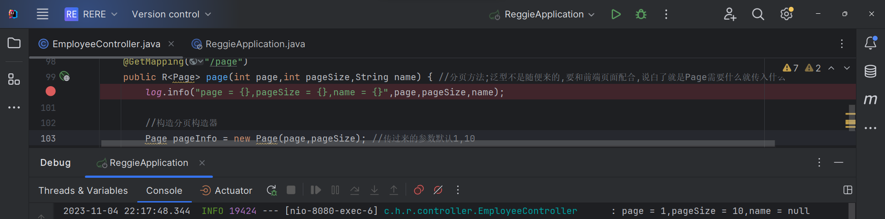

# 瑞吉外卖 笔记二

## 1.完善登录功能

- 问题分析
存在问题: 用户不登陆直接访问系统首页面照样可以正常访问,不合理-> 希望:只有登陆成功之后才可以访问系统中的页面,如果没有登录就跳转到登录页面.

实现方法: 使用过滤器/拦截器
    ps,在项目里应该是前端来做:通过判断是否贮存token,用路由守卫拦截/放行


- 代码实现

> 实现步骤  
    1. 创建自定义过滤器LonginCheckFilter
    2. 在启动类上加入注解@ServletComponentScan (如果不加不能生效,相当于是开启组件扫描,才会去扫描过滤器)  
    3. 完善过滤器的处理逻辑  

1-2在LoginCheckFilter中完成;  

通过log.info("拦截到请求:{}",request.getRequestURI());输出日志,是可以拦截到的: 拦截到3个请求,一个index.html,一个分页请求,还有一个图标请求  

3完善:根据具体逻辑补充代码


- 功能测试
添加一些输出日志来帮调试


## 2.新增员工

> *查看请求-提交的参数和请求*  
*异常捕获违反唯一约束*
梳理整个程序运行过程之后:

-> 数据能正常封装


- 需求分析
后台系统中可以管理员工信息，通过新增员工来添加后台系统用户。点击 添加员工 按钮跳转到新增页面，如下:


- 数据模型
就是把我们新增页面录入的员工数据插入到employee表。需要注意，employee表中对username字段加入了唯一约束，员工的登录账号须唯一

- 代码开发
在开发代码之前，需要梳理一下整个程序的执行过程:
*执行过程*


`EmployeeService`
前面的程序还存在一个问题，就是当我们在新增员工时输入的账号已经存在，由于employee表中对该字段加入了唯一约束，此时程序会抛出异常:
```java
java.sql.SQLIntegrityConstraintViolationException: Duplicate entry 'heniang' for key 'idx_username'
```

则需要程序异常捕获,处理方式:
1. 在Controller方法中加入try.catch进行异常捕获
2. 使用异常处理器进行全局异常捕获
`common`
 不是一步到位的,先确定可以起作用再完善代码

- 功能测试


总结:开发的系统都是 请求响应式 的模式


## 3.员工信息分页查询

> *整个程序的执行流程,前端需要的数据-我们需要给出的数据*
*先确定能够正常接收*


- 需求分析
系统中员工很多,不能一个页面,所以需要分页展示


- 代码开发
在开发代码之前，需要梳理一下整个程序的执行过程:


1配置MP分页插件 2员工信息分页查询
`EmployeeController`

 第一步,检查参数封装没有问题,能够正常接收


- 功能测试


## 4.启用/禁用员工账号
> *了解执行过程,controller根据id修改员工信息-测试发现没有修改成功*
*观察数据可知id值不相同-进行代码修复-"状态修改成功"*

- 需求分析
在员工管理列表页面，可以对某个员工账号进行启用或者禁用操作。账号禁用的员工不能登录系统，启用后的员工可以正常登录。

需要注意，只有管理员（admin用户）可以对其他普通用户进行启用、禁用操作，所以普通用户登录系统后启用、禁用按钮不显示。

- 代码开发
    - 页面中是怎么做到只有管理员admin能够看到启用、禁用按钮的？-动态展示按钮
    

    - 在开发代码之前，需要梳理一下整个程序的执行过程:
    1. 页面发送ajax请求，将参数(id、 status)提交到服务端
    2. 服务端Controller接收页面提交的数据并调用Service更新数据
    3. Service调用Mapper操作数据库
    
    

Day3~~努力理解,虽然项目还是没有跑起来.加油,最好能讲给自己

- 功能测试
测试过程中没有报错,但是Updates:0 功能无法实现,查看数据库中的数据也没有变化。观察控制台输出的SQL:

仔细观察id的值，和数据库中对应记录的id值并不相同


- 代码修复
失败原因:
通过观察控制台输出的SQL发现页面传递过来的员工id的值和数据库中的id值不一致，这是怎么回事呢?

分页查询时服务端响应给页面的数据中id的值为19位数字，类型为long

页面中js处理long型数字只能精确到前16位，所以最终通过ajax请求提交给服务端的时候id就改变了

前面我们已经发现了问题的原因，即js对long型数据进行处理时丢失精度，导致提交的id和数据库中的id不一致。

如何解决:
在服务端给页面响应json数据时进行处理，将long型数据统一转为String字符串

**具体实现步骤**
1. 提供对象转换器JacksonobjectMapper,基于Jackson进行Java对象到json数据的转换

2. 
在WebMvcConfig配置类中扩展Spring mvc的消息转换器,在此消息转换器中使用提供的对象转换器, 进行java对象到json数据的转换
 - 注:
 可以这样认为,spring一开始只有一个容器,而我们的注解,都是依靠这些组件解析; spring的所有功能,都是依靠组件来完成的. 前端这个消息转换器,就是spring mvc底层的组件 


## 5.编辑员工信息
> *实现成功*
交互过程1-5

交互过程


- 需求分析
在员工管理列表页面点击编辑按钮，跳转到编辑页面，在编辑页面回显员工信息并进行修改，最后点击保存按钮完成编辑操作


- 代码开发
在开发代码之前需要梳理一下操作过程和对应的程序的执行流程:

修改过程有两次和服务端交互 1发送请求查询数据进行回显 2修改之后的数据提交到服务端

- 功能测试
OK
