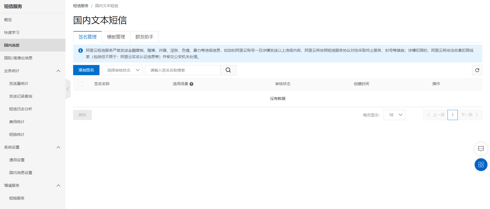
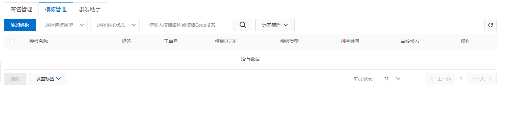
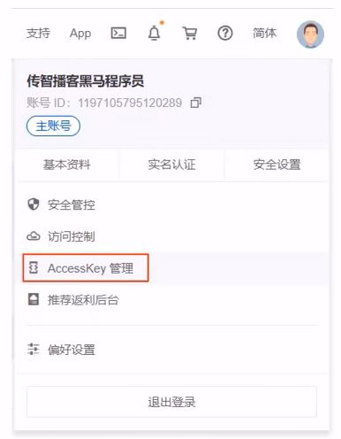
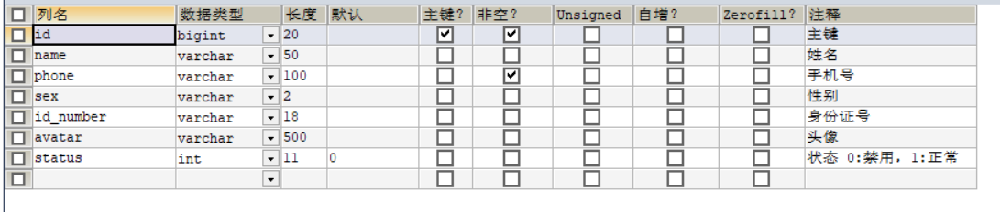

# 手机验证码登录

> 需要阿里云官网注册和审核 收费 ,个人小程序不能使用(腾讯云) 

## 短信发送
>  短信服务介绍
目前市面上有很多第三方提供的短信服务，这些第三方短信服务会和各个运营商(移动、联通、电信)对接，  
我们只需要注册成为会员并且按照提供的开发文档进行调用就可以发送短信。  
需要说明的是，这些短信服务一般都是收费服务

常见的短信服务:

    阿里云
    华为云
    腾讯云
    京东
    梦网
    乐信

- *阿里云短信服务*

    - 介绍
    广大企业用户的选择.调用API或用群发助手，即可发送.

    - 注册账号

    - 设置短信签名

    - 设置短信模板

    - 设置AccessKey

- 代码开发

## 手机验证码登录

- 需求分析
为了方便用户登录，移动端通常都会提供通过手机验证码登录的功能。

手机验证码登录的优点:

    方便快捷，无需注册，直接登录
    使用短信验证码作为登录凭证，无需记忆密码
    安全

登录流程:
输入手机号>获取验证码>输入验证码>点击登录>登录成功

注意:通过手机验证码登录，手机号是区分不同用户的标识

- 数据模型
通过手机验证码登录时，涉及的表为user表，即用户表。结构如下:

- 代码开发

- 效果展示