# 套餐管理业务开发

## 新增套餐

> 开发新增套餐功能,其实就是再服务端编写代码去处理前端页面发送的这个6次请求即可

- 需求分析
后台系统中可以管理套餐信息，通过新增套餐功能来添加一个新的套餐，在添加套餐时需要选择当前套餐所属的 套餐分类和包含的菜品 ，并且需要上传套餐对应的图片，在移动端会按照套餐分类来展示对应的套餐
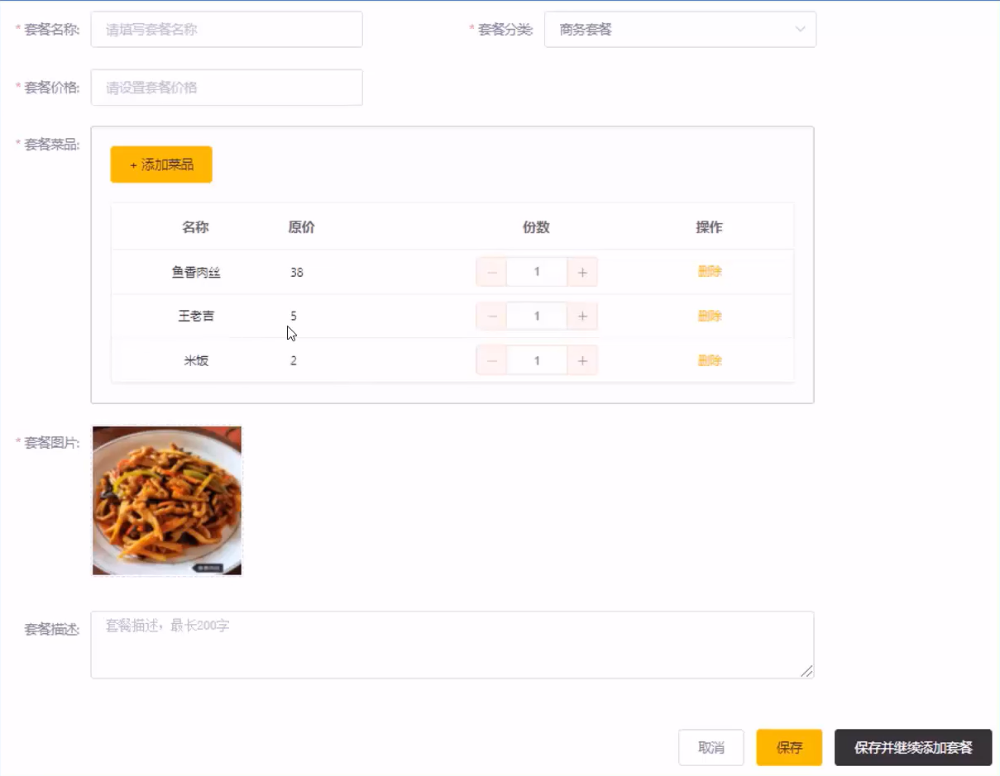
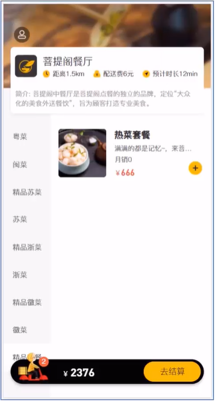

- 数据模型
其实就是将新增页面录入的套餐信息插入到setmeal表，还需要向setmeal_dish表插入套餐和菜品关联数据。所以在新增套餐时，涉及到两个表:
1. setmeal 套餐表
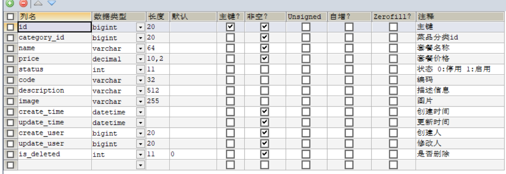
2. setmeal_dish  套餐菜品关系表
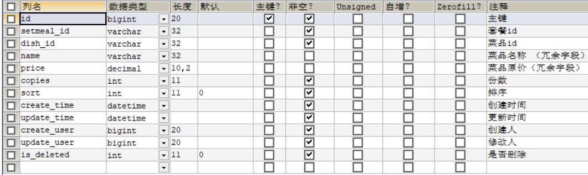

- 代码开发
0. 在开发业务功能前，先将需要用到的类和接口基本结构创建好:
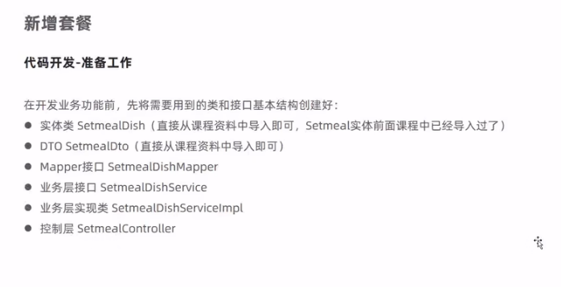

1. 梳理交互过程
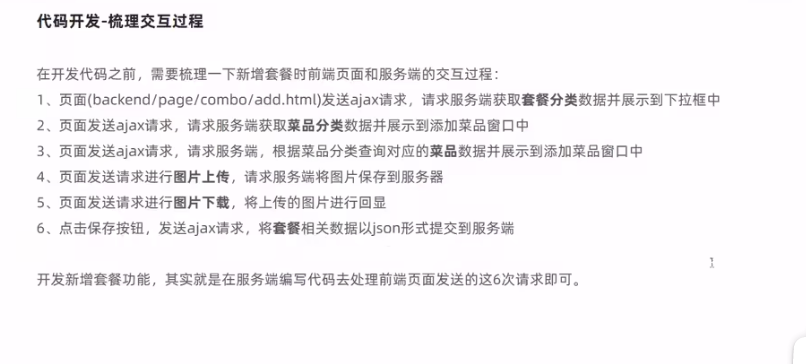
    1.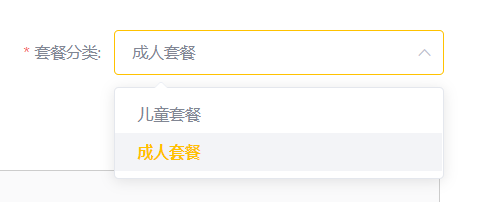
    3.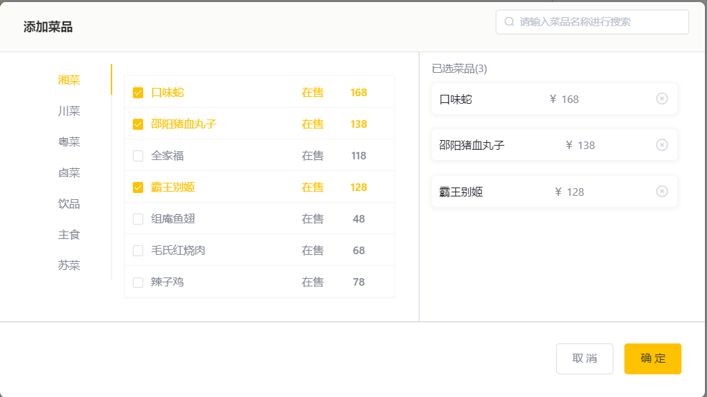
    6.套餐相关数据以JSON形式提交到服务端
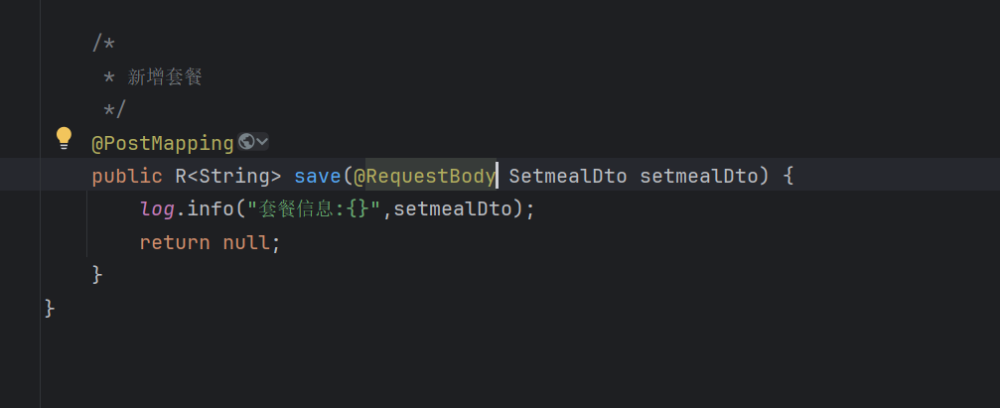
//涉及两张表

- 功能测试~

## 套餐信息分页查询

- 需求分析
系统中的套餐数据很多的时候，如果在一个页面中全部展示出来会显得比较乱，不便于查看，所以一般的系统中都会以分页的方式来展示列表数据

- 代码开发
0.  先梳理一下交互过程
 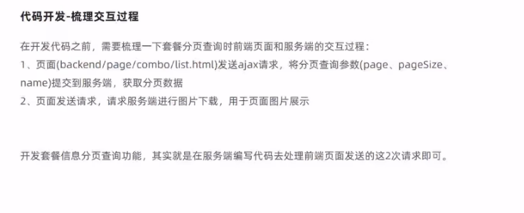

- 功能测试~
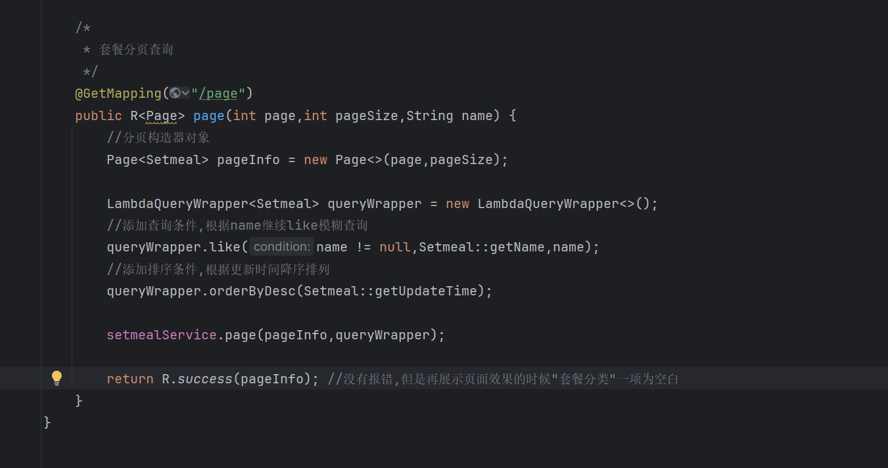

完善代码(数据不是完全匹配) ceshi ~~

## 删除套餐

- 需求分析
在套餐管理列表页面点击删除按钮，可以删除对应的套餐信息。
也可以通过复选框选择多个套餐，点击批量删除按钮一次删除多个套餐。
注意，对于状态为售卖中的套餐不能删除，需要先停售，然后才能删除。

- 代码开发
0. 梳理交互过程

删除套餐,是删除套餐表和关联的菜品关系,涉及两张表

- 功能测试~

## ...修改套餐**

# 手机验证码登录

## 短信发送

## 手机验证码登录