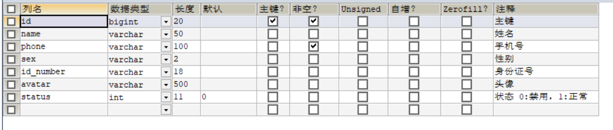

# 套餐管理业务开发

## 新增套餐

> 开发新增套餐功能,其实就是再服务端编写代码去处理前端页面发送的这个6次请求即可

- 需求分析
后台系统中可以管理套餐信息，通过新增套餐功能来添加一个新的套餐，在添加套餐时需要选择当前套餐所属的 套餐分类和包含的菜品 ，并且需要上传套餐对应的图片，在移动端会按照套餐分类来展示对应的套餐

- 数据模型
其实就是将新增页面录入的套餐信息插入到setmeal表，还需要向setmeal_dish表插入套餐和菜品关联数据。所以在新增套餐时，涉及到两个表:
1. setmeal 套餐表

2. setmeal_dish  套餐菜品关系表

- 代码开发
0. 在开发业务功能前，先将需要用到的类和接口基本结构创建好:

1. 梳理交互过程

(*要完成的是第3开始*)
    1.
    3.
    6.套餐相关数据以JSON形式提交到服务端

//涉及两张表

- 功能测试~

## 套餐信息分页查询

- 需求分析
系统中的套餐数据很多的时候，如果在一个页面中全部展示出来会显得比较乱，不便于查看，所以一般的系统中都会以分页的方式来展示列表数据

- 代码开发
0.  先梳理一下交互过程
 

- 功能测试~

完善代码(数据不是完全匹配) ceshi ~~

## 删除套餐

- 需求分析
在套餐管理列表页面点击删除按钮，可以删除对应的套餐信息。
也可以通过复选框选择多个套餐，点击批量删除按钮一次删除多个套餐。
注意，对于状态为售卖中的套餐不能删除，需要先停售，然后才能删除。

- 代码开发
0. 梳理交互过程

删除套餐,是删除套餐表和关联的菜品关系,涉及两张表

- 功能测试~

## ...修改套餐**

# 邮件发送

- 需求分析:
为了方便用户登录 (手机验证码平替成为邮箱验证码)
注意: 通过手机(邮箱验证码)登录,手机号是区分不同用户的标识

- 数据模型

> 手机号是Varchar类型(不用动) -> 存邮箱号

- 代码开发
0. 梳理交互

1. 开发业务功能之前,先把要用到的 类和接口 基本结构创建好
  

    - 实体类User
    - Mapper接口UserMapper
    - 业务层接口UserService
    - 业务层实现类UserServiceImpl
    - 控制层UserController
    - *工具类*    (我们自己造自己的邮箱工具类)

- **工具类**
    - 首先导入坐标

    - 然后编写一个工具类,用于发送邮箱验证码

    > *Summerary*

            这段代码是一个用于发送邮箱验证码的工具类MailUtils。主要包含以下几个方法：

        1. sendTestMail()：发送测试邮件的方法。该方法使用JavaMail API来发送邮件，需要传入收件人邮箱和验证码作为参数。

        2. achieveCode()：生成随机验证码的方法。该方法生成一个由6个字符组成的随机字符串，包含数字和大小写字母，但不包含数字1、0和字母O、L，以避免与其他字符混淆。

        在sendTestMail()方法中，首先创建了一个Properties对象，用来记录邮箱属性。然后设置了SMTP服务器、端口号、发件人账号、口令等信息。接着创建了一个Authenticator对象，用于进行SMTP身份验证。最后使用Session类创建了一个邮件会话，并创建了一个MimeMessage对象作为邮件消息。设置了发件人、收件人、邮件标题和内容，最后调用Transport类的send()方法发送邮件。

        在achieveCode()方法中，首先创建了一个包含数字和大小写字母的字符串数组，然后将数组转换为集合，使用Collections.shuffle()方法打乱集合顺序，最后将集合转换为字符串，并返回其中的第3到第8个字符作为验证码。

        Day6 依赖包无法导入~~其他感觉还可以,自己写真的能写出来吗.或者说看别人的文件呢?
        之后复盘 like 看文件-讲给自己~~~

2. 修改拦截器
    - 对用户登录操作放行

    - 判断用户是否登录

3. 发送验证码
    - 清除浏览器缓存验证是否收到请求
    - 输入验证码点击登录
    - login -> 是否获取到数据