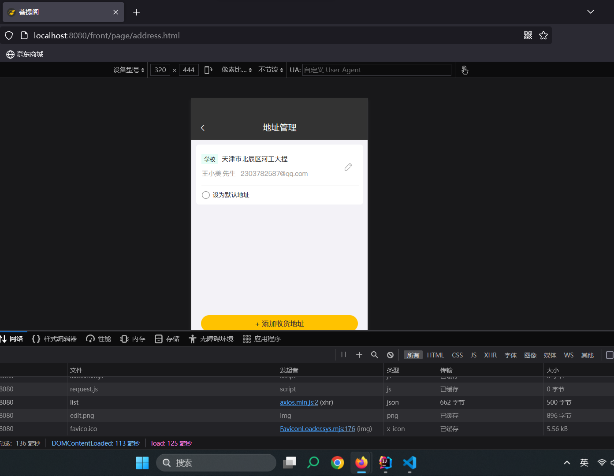
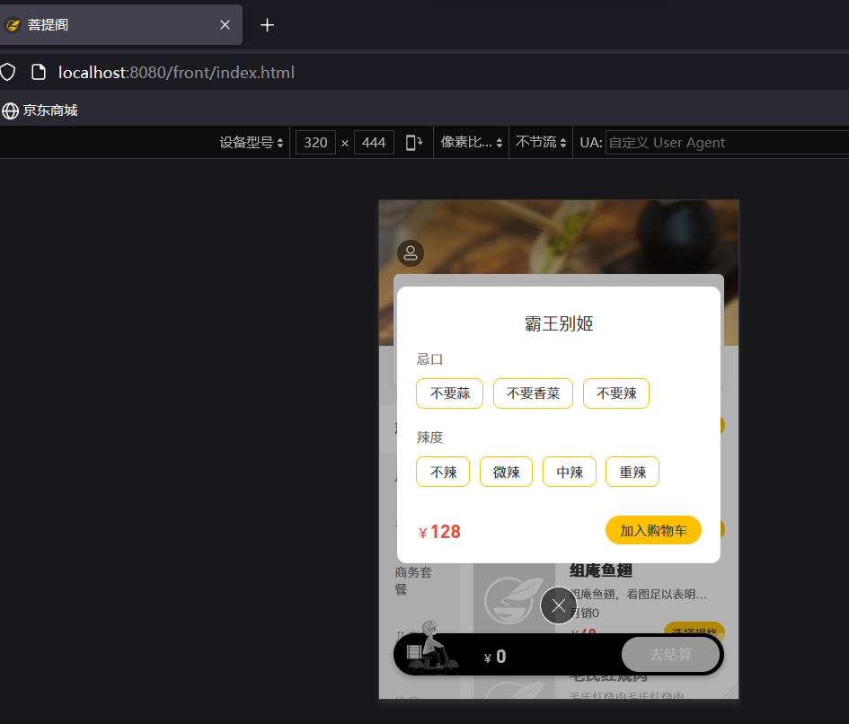
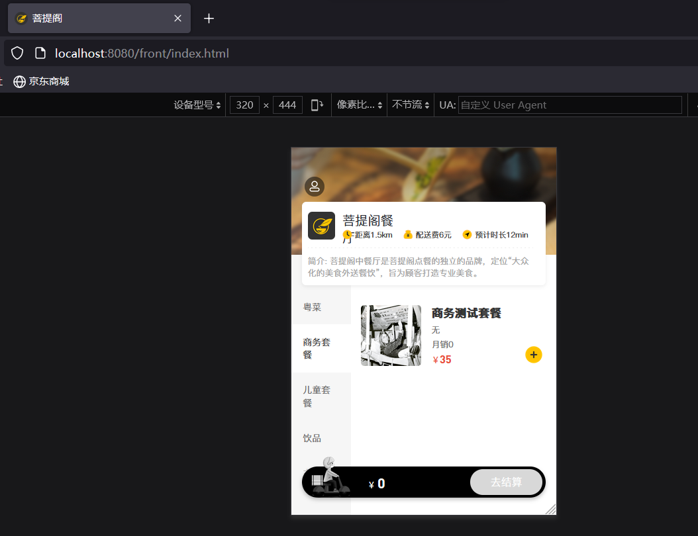
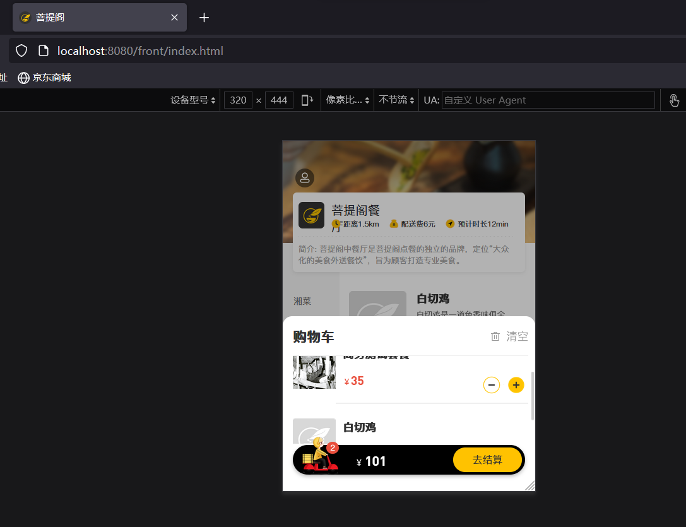

# 邮箱验证(版本2)
微博邮箱 但是前端都需要修改..NO


# 登录后的功能

> 数据模型中长度需要i需改

## 导入用户地址

- 需求分析
    - 用户登录成功后可以维护自己的地址信息;
    - 可以多个地址但是只能有一个默认地址

- 数据模型
phone类型为varchar(11),为了邮箱使用需修改长度.

- 代码
    - 0准备工作
    entity;Mapper;Service;Controller
    - 核心代码
        1. (点击地址管理) 请求网址: http://localhost/addressBook/list; 请求方法: GET
        2. 已知请求路径和方式,在controller中编写对应方法..
        3. 写完之后暂无效果(数据库中没有对应账号数据) ->新增地址,方法思路同上
        4. 新增收货地址
        
        **新增地址时,address_book中的phone长度修改**

        5. 设置默认地址
        > 就是数据库中is_default字段为1 
        *如何保证*,次设置默认地址的时候，将当前用户所有地址的is_default字段设为0，随后将当前地址的is_default字段设为1
        1. 请求网址: http://localhost/addressBook/default;请求方法: PUT
        2. Controller中编写对应方法


- 功能测试


## 菜品展示

- 需求分析
    - 用户登陆成功之后，跳转到菜品页面，根据菜品分类来展示菜品和套餐
    -  如果菜品设置了口味信息，则需要展示选择规格按钮，否则只展示+按钮（这部分是前端实现）

- 梳理过程
    1. 页面(front/index.html)发送ajax请求，获取分类数据（菜品分类和套餐分类）
    2. 页面发送ajax请求，根据具体的菜品/套餐分类，展示对应分类中的具体菜品

    - 注意: 发现登录到首页会发送两个请求
        - 请求网址: http://localhost/category/list; 请求方法: GET
        - 请求网址: http://localhost/shoppingCart/list; 请求方法: GET

        其中,分类请求写过但是访问页面的时候并没有加载出来,
  
**前端代码解读**
```java
  methods: {
            //初始化数据
            initData() {
                Promise.all([categoryListApi(), cartListApi({})]).then(res => {
                    //获取分类数据
                    if (res[0].code === 1) {
                        this.categoryList = res[0].data
                        if (Array.isArray(res[0].data) && res[0].data.length > 0) {
                            this.categoryId = res[0].data[0].id
                            if (res[0].data[0].type === 1) {
                                this.getDishList()
                            } else {
                                this.getSetmealData()
                            }
                        }
                    } else {
                        this.$notify({type: 'warning', message: res[0].msg});
                    }
                    //获取菜品数据
                    if (res[1].code === 1) {
                        this.cartData = res[1].data
                    } else {
                        this.$notify({type: 'warning', message: res[1].msg});
                    }
                })
            },
```
分析: 这段代码->初始化数据的函数.
1. 调用了两个异步api,并使用`Promise.all()`来等待他们都完成,若都完成-执行then()回调函数
2. 回调函数先判断获取分析数据的api返回的结果是否成功,若成功-返回的数据赋值-获取第一个分类的id并根据分类的type来调用不同函数获取菜品数据
3. 判断获取菜品数据的api是否成功-成功将返回的数据赋值
(如果不成功,显示警告信息)


- 代码开发
**代码解读完成编写请求路径**
1. `CategoryListApi()`
之前写过(Controller)

2. `cartListApi`
购物车相关还没写,先待定写死 (后续增加购物车要修改)

**选择规格**
- 需求: 部分菜品有口味选择,分析前端index.html
```html
<div class="divTypes" v-if="detailsDialog.item.flavors && detailsDialog.item.flavors.length > 0 && !detailsDialog.item.number " 
@click ="chooseFlavorClick(detailsDialog.item)">选择规格</div>               
```
但我们返回的List<Dish>，其中并没有flavors属性 -> 修改为返回DishDto(新增flavors属性)(和前面涉及过的类似)

**套餐展示**
- 菜品展示已经完成

但是套餐和菜品不是一个Controller,套餐的还需要完成
请求网址: http://localhost/setmeal/list?categoryId=1413342269393674242&status=1; 请求方法: GET

- 在`SetmealController`中编写对应的方法
简单,没有口味数据

- 功能测试


## 购物车

- 需求分析
可以添加菜品/套餐; 
如果有口味信息需要选择规格之后才能加入(前端实现);
在购物车中可以修改数量,也可以清空

- 梳理准备
    - 梳理交互 
    1. 点击加入购物车按钮,页面发送ajax请求,请求服务端添加
    2. 点击购物车图标,页面发送ajax请求,请求服务端查询购物车中的菜品和套餐
    3. 点击清空购物车按钮,页面发送ajax请求,请求服务端执行清空操作

    - 准备工作
    类和接口的基本结构 ShoppingCart
  
- 代码开发
**加入购物车**
- 点击后页面发送请求,请求路径/shoppingCart/add，请求方式POST,页面将数据以JSON形式发给服务端 -> 在shoppingCart的Controller中添加相应方法


**查看购物车**
- 之前为了不报错写死了的购物车地址,现在需要修改
- 请求路径为/shoppingCart/list，请求方式为GET,在controller中添加方法

**清空购物车**
- 清空按钮，请求路径为/shoppingCart/clean，请求方式为DELETE
- 基本逻辑,简单-获取用户Id然后去数据库shopping__cart表中删除对应id的数据即可-Controller中编写方法



## 用户下单

- 需求分析
添加购物车之后点击去结算,页面跳转到订单确认页面,点击去支付按钮,完成下单操作

- 数据模型
下单业务对应的数据表为orders表和order_detail表

- 准备分析(跳转到订单确认页面)
    - 准备
    orders/orderDetail Mapper..
    - 分析
    点击去结算按钮,查看发送的请求url和方式
    请求网址: http://localhost/addressBook/default; 请求方法: GET
    页面跳转到确认订单界面,发送ajax请求-用于获取用户的默认地址，但是请求失败，服务端没有对应的映射 -> AddressBookController编写方法
- 准备分析(结算)
    - 分析
    点击去结算,请求网址: http://localhost/order/submit; 请求方法: POST -> 在OrderController中开发功能; (具体的submit方法我们放在OrderService写，OrderController调用写好的submit方法)
    提交给服务端的数据格式为JSON
    - 具体功能:
    获取当前用户id
    根据用户id查询其购物车数据
    根据查询到的购物车数据，对订单表插入数据（1条）
    根据查询到的购物车数据，对订单明细表插入数据（多条）
    清空购物车数据
    - 虽然代码量多,但是简单-大部分都是赋值操作


- 代码开发

- 功能测试