# 菜品管理

## 文件上传下载

> *文件上传,主要是利用组件,并且创建好目录和解决命名问题*

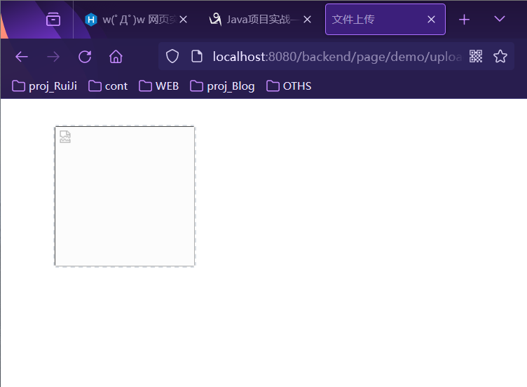

*文件下载: 发送文件下载请求,传参数(name文件名称)-到指定目录读取文件(输入流)-(输出流)往回写浏览器-显示图片*
(文件上传和下载 这里 都是之后可以复用的)

- 文件上传介绍
    - 指将本地图片、视频、音频等文件上传到服务器上，可以供其他用户浏览或下载的过程.  
    - 文件上传对表单的要求:
    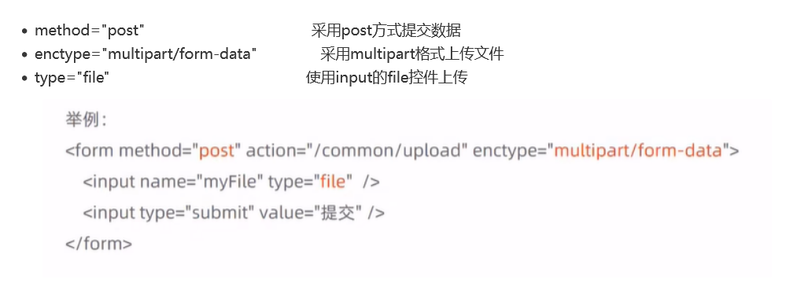

    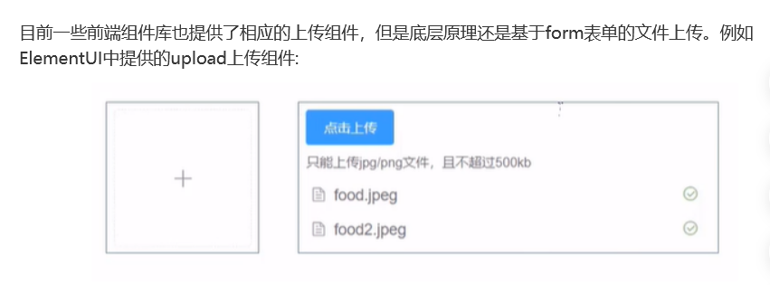

    - 服务端接收文件上传
    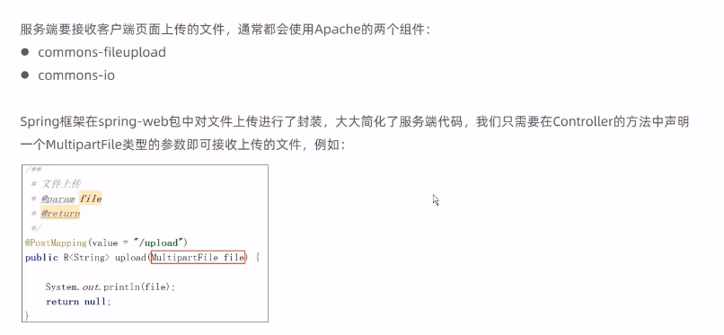

- 文件下载介绍

    - 指将文件从服务器传输到本地计算机的过程。通过浏览器进行文件下载，通常有两种表现形式:
    1. 以附件形式下载，弹出保存对话框，将文件保存到指定磁盘目录
    2. 直接在浏览器中打开

- 文件上传代码实现

    - 文件上传，页面端可以使用ElementuI提供的上传组件。可以直接使用资料中提供的上传页面. `upload.html`  

    - 代码编写0:
    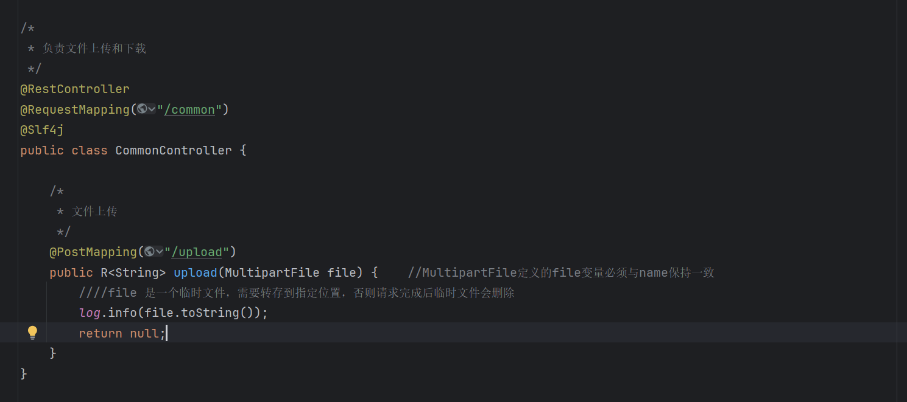
    
    Day4 还阔以~~ 一整天都在看,有一丢丢感觉了. 重点是最后Day6做完了要复盘,看其他的才能看懂

    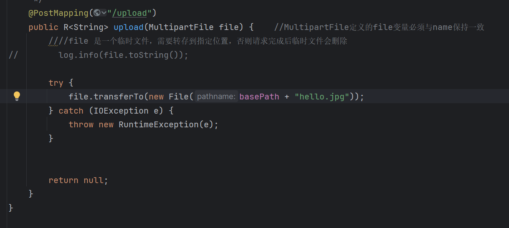
    注意,依旧是险些框架,后面再完善修改,比如一开始的固定地址-YML配置文件夹可修改-动态文件名-防止覆盖,UUID.后缀-存储文件夹

    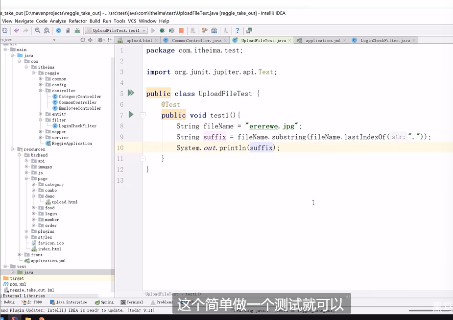
    想要截文件后缀,验证边界,是否有"."

    逐步完善我们的代码. 最后返回值, -应该是文件名:
    因为页面是需要用到文件名(存到数据库)

- 文件下载代码实现

    - 文件下载，页面端可以使用标签展示下载的图片
    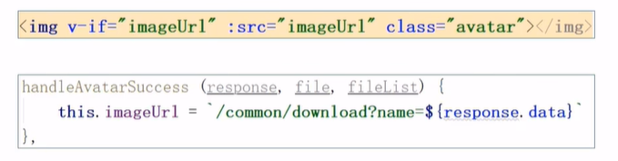

## 新增菜品

> *交互过程: 先发送请求来显示分类(下拉框)-上传图片-图片下载回显-发送请求体提交数据(到服务器,JSON)*

- 需求分析
后台系统中可以管理菜品信息，通过新增功能来添加一个新的菜品，在添加菜品时需要选择当前菜品所属的菜品分类,并且需要上传菜品图片，
在移动端会按照菜品分类来展示对应的菜品信息。
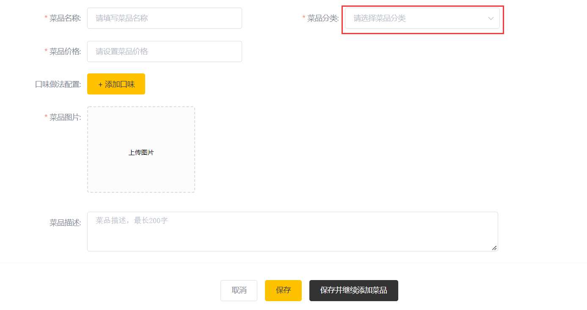

- 数据模型
其实就是将新增页面录入的菜品信息插入到dish表，如果添加了口味做法，还需要向dish_flavor表插入数据。
所以在新增菜品时，涉及到两个表:
1. dish(菜品表)
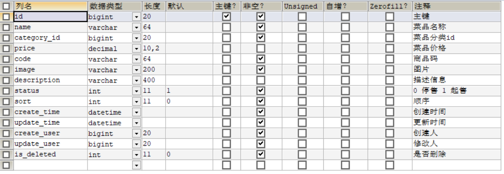
2. dish_flavor(菜品口味表)
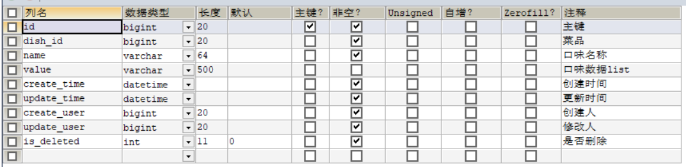

- 代码开发
准备工作
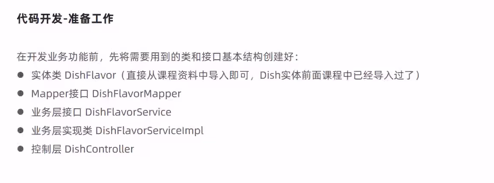
梳理过程(和服务器有4次交互过程,稍微复杂)
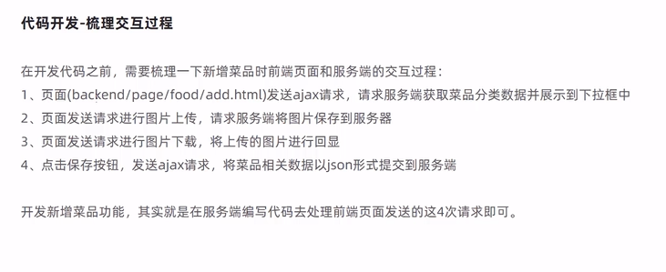

**菜品分类下拉框** 过程分析: -> 就是编写返回的这个方法来实现下拉
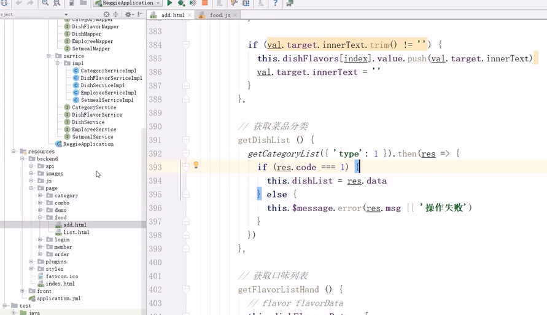

- 明确提交后的数据~
(交互4,菜品相关数据JOSN形式传到服务端)

1. 引入DTO(数据传输对象,用于封装页面提交的数据) <- 展示层和服务层之间的数据传输
    - 前面没有用,因为展示的都是和实体的属性一一对应的

    新增菜品同时插入菜品对应的口味数据,需要操作两张表：dish、dishflavor
    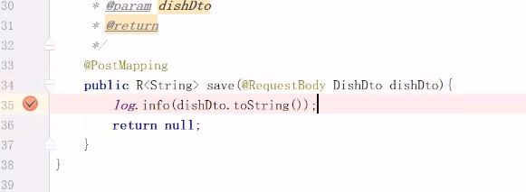
    可以正常封装JSON  

    分析 -> 由于涉及两张表,不能直接dish.service然后save就可以,需要扩展:
    在DishService接口中添加方法saveWithFlavor,在DishServiceImpl实现

- 功能测试~~

Day5 感觉自己没有动脑子,但是有很多重复性的代码已经比较熟悉了.

## 菜品信息分页查询

- 需求分析
系统中的菜品数据很多的时候，如果在一个页面中全部展示出来会显得比较乱，不便于查看，所以一般的系统中都会以分页的方式来展示列表数据。
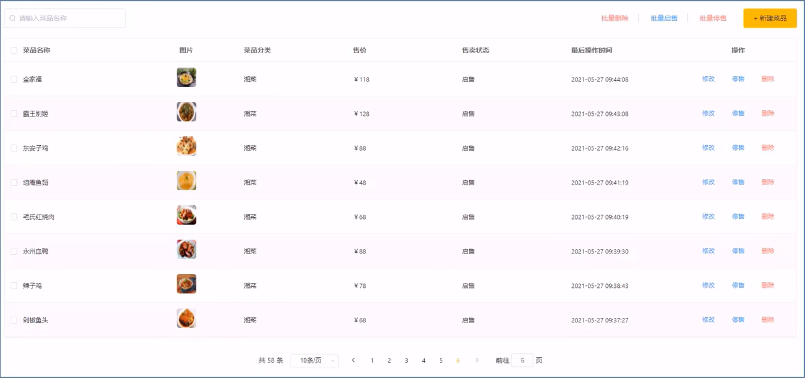

- 代码开发
0. **梳理交互过程**
在开发代码之前，需要梳理一下菜品分页查询时前端页面和服务端的交互过程:
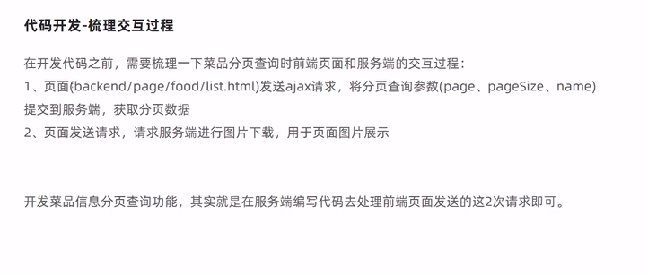

1. 代码略微有些复杂, 主要是考虑需要反应在页面上的是什么

- 功能测试
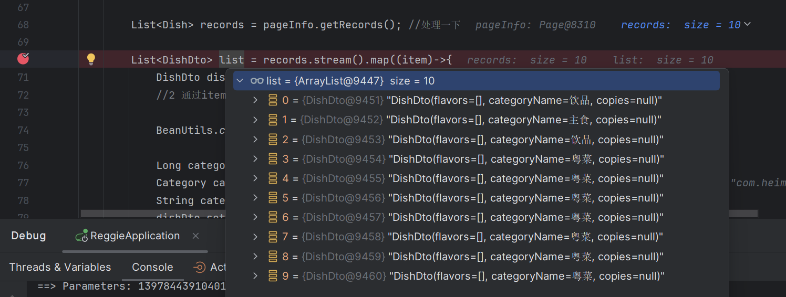

## 修改菜品

> *调试过程中成功回显*
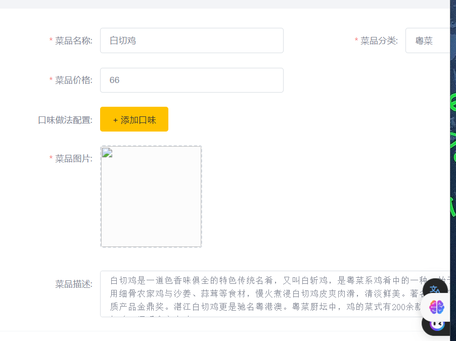

- 需求分析
在菜品管理列表页面点击修改按钮，跳转到修改菜品页面，在修改页面回显菜品相关信息并进行修改，最后点击确定按钮完成修改操作
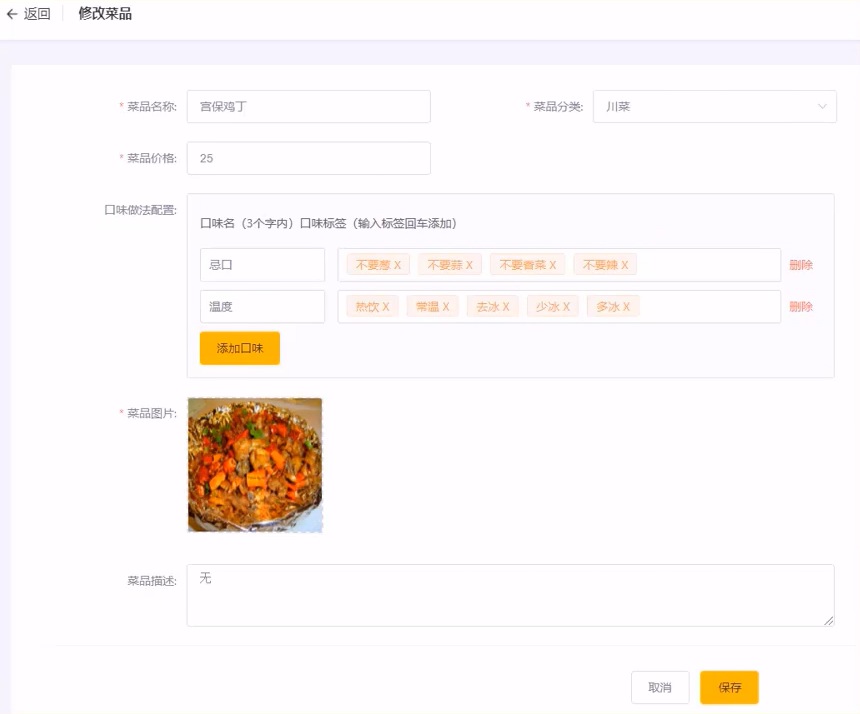

- 代码开发
和服务端的交互分析
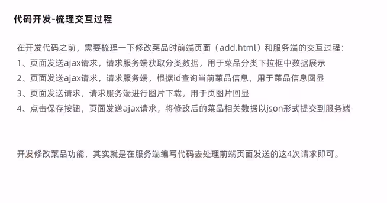   (前面add.html已经写过了,都是共用的.需要写的是 2 4)
需要完成的服务:2(dish中没有口味属性) DishController中代码简单,主要逻辑是封装在了DishService里面

- 功能测试

## 停售/起售菜品,删除菜品

- 需求分析
在商品买卖过程中，商品停售，起售可以更加方便的让用户知道店家还有什么类型的商品在卖。删除方法也更方便的管理菜品

- 代码实现
交互较少并不复杂